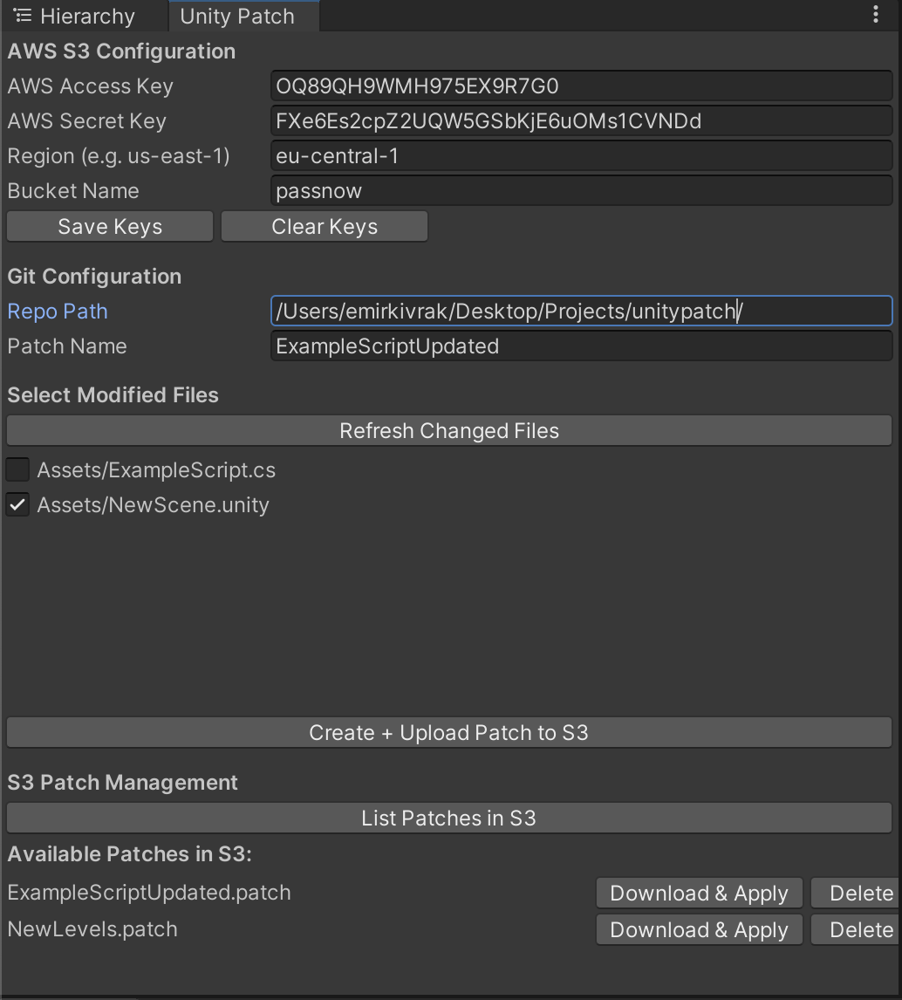
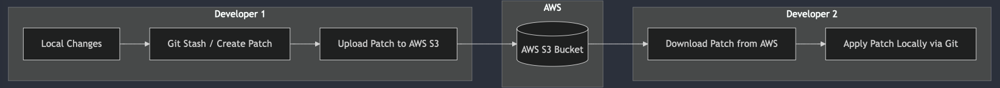

# Unity Patch

With Unity Patch, save and share your local changes effortlessly with your team, without committing to your Git repository.




---

## Project Overview - Developer Notes

External libraries or third-party installs are **not required**. UnityPatch.cs uses:
- Web requests for S3 interactions.
- Your system’s bash environment for git commands.

### Why using a S3 instead of git itself for sharing patch files?

Using a S3 to store patch files serves two main purposes.

First, it prevents adding patch files directly to the repository, avoiding patch files stored in repository. 

Second, it keeps the commit history clean by not committing these patches. Because the patch management system remains external to the main project/Git, history stays simpler and more maintainable.



## Prerequisites

- **Unity**: Version 2020.1 or newer.
- **Git**: Installed and added to your system's PATH.
- **AWS S3 Bucket**: Access credentials (Access Key, Secret Key, Region, and Bucket Name) configured and ready for use.
- **Git Repository**: Your Unity project must be initialized as a Git repository.

---

## Installation

1. Download `UnityPatch.cs` file:
2. Copy the `UnityPatch.cs` file into your Unity project.
4. Go to **Tools > Unity Patch** in the Unity menu bar to open the Unity Patch window.

---

## Setup

### AWS S3 Configuration

1. Open the Unity Patch window.
2. Enter your AWS credentials:
   - Access Key
   - Secret Key
   - Region (e.g. `us-east-1`)
   - Bucket Name
3. Click **Save Keys** to store the credentials securely.

**If you don't have these keys, read How to Get AWS Keys for S3 section below.**

### How to Get AWS Keys for S3

1. **Sign in to the AWS Management Console**:  
   Go to [aws.amazon.com](https://aws.amazon.com/) and sign in.
2. **Open the IAM console**:  
   In the AWS console search bar, type **IAM** and select it.
3. **Create or select an existing user**:  
   - If you need a new user, click **Add Users** and select **Programmatic access**.
   - Attach an existing policy like **AmazonS3FullAccess** or use a custom policy.
4. **Retrieve your keys**:
   - After user creation (or editing credentials), you will see **Access Key ID** and **Secret Access Key**.
   - **Download** the .csv file or copy them somewhere safe. You **cannot** view the secret key again later.


### Git Configuration

1. By default, Unity Patch uses the root of your Unity project (`../`) as the Git repository path.
2. Ensure that your Unity project is initialized as a Git repository:
   ```bash
   cd /path/to/your/unity-project
   git init
   ```
3. Verify Git is installed and accessible via the command line by running:
   ```bash
   git --version
   ```

---

## Usage

### Create and Upload a Patch

1. Open the Unity Patch tool from the Unity Editor: **Tools > Unity Patch**.
2. Enter a patch name (or use the default).
3. Click **Create + Upload Patch to S3** to:
   - Generate a patch file of your local changes.
   - Upload it to the configured AWS S3 bucket.

### List Available Patches

1. Click **List Patches in S3** to retrieve a list of patch files from your S3 bucket.

### Download and Apply a Patch

1. Select a patch from the listed files in the Unity Patch window.
2. Click **Download & Apply** to:
   - Download the selected patch to your local system.
   - Apply the patch to your Git repository.

*Don't Forget to reset patch's changes before commit your changes.**


